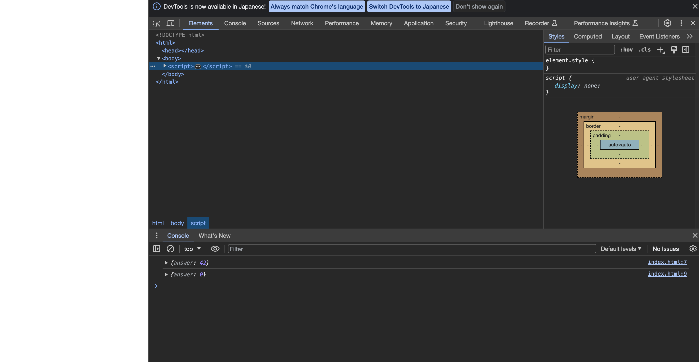
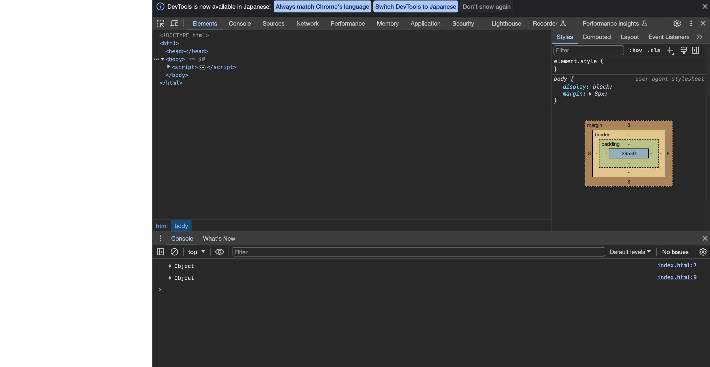

# 解答

## 問

以下の内容を index.html に保存し、Web ブラウザで開きなさい。
開発者ツール (Chrome の場合 F12) のコンソール上に何が表示されるか予想し、結果が一致するか確認しなさい。
開発者ツールを開いた状態のタブで HTML を開く場合と、HTML を開いた状態のタブで開発者ツールを開く場合とで、結果を比較しなさい。
また、常に期待した結果を得るためにはどのようにコードを修正すべきか答えなさい。

## 予想

変数lifeに代入されているオブジェクトの文字列表現である謎の文字列がコンソール上に表示される。

## 結果

### 開発者ツールを開いた状態のタブで HTML を開く場合

```sh
{answer: 42}
{answer: 0}
```

と表示される


### HTML を開いた状態のタブで開発者ツールを開く場合

```sh
Object
Object
```

と表示される


## 修正案

`console.log`の引数を`life`でなく`life.answer`とする

```js
<!DOCTYPE html>
<html>

<body>
    <script>
        let life = { answer: 42 };
        console.log(life.answer);
        life.answer = 0;
        console.log(life.answer);
    </script>
</body>

</html>
```
