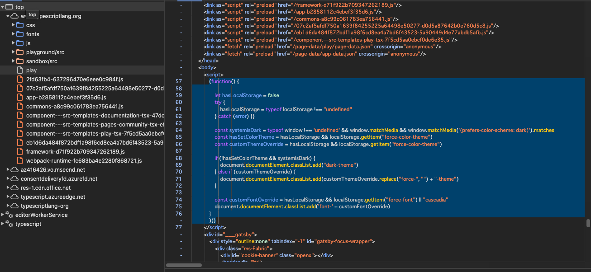

# 答案

https://www.typescriptlang.org/play?

なお、該当部分の処理は以下のとおり

> このコードは、JavaScriptの自己実行関数であり、ウェブサイトのカラーテーマとフォント設定などのユーザーインターフェース(UI)を一部制御しています。
> 具体的には以下の操作を行っています：
> localStorageオブジェクトが存在するか（つまりブラウザがlocalStorageをサポートしているか）を確認します。
> システムのカラーテーマがダークモードであるかを確認します（window.matchMediaを使用）。
> ユーザーが任意のカラーテーマを設定しているか（localStorage中にforce-color-themeが存在するか）を確認します。
> カラーテーマが設定されていない場合かつシステムのカラーテーマがダークならば、ドキュメントにdark-themeクラスを追加します。
> カラーテーマが設定されている場合、その値（force-color-themeの値からforce-を除いたもの）に基づいてドキュメントに対応するカラーテーマクラスを追加します。
> ユーザーが任意のフォントを設定しているか（localStorage中にforce-fontが存在するか）を確認し、存在しなければデフォルトのフォント（ここではcascadia）を使用し、その結果に基づきfont-の後にフォント名を追加したクラスをドキュメントに追加します。
> このコードの目的は、ウェブページのテーマ（明るいか暗いか）と使用するフォントをユーザーのシステム設定やローカルストレージ内の設定に基づいて動的に変更することで、ユーザーインターフェースのカスタマイズを可能にすることです。
