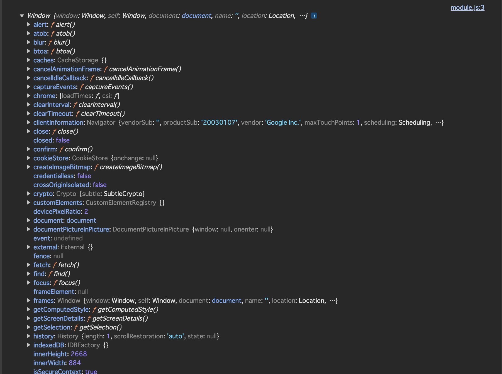

# 答案

## グローバルオブジェクトを参照する

### ブラウザ内で参照する方法

#### 方法

以下のスクリプトを実行する:

```js
console.log(window);
```

#### 結果



### node内で参照する方法

#### 方法

以下のスクリプトを実行する:

```js
console.log(global);
```

#### 結果

```js
<ref *1> Object [global] {
  global: [Circular *1],
  clearImmediate: [Function: clearImmediate],
  setImmediate: [Function: setImmediate] {
    [Symbol(nodejs.util.promisify.custom)]: [Getter]
  },
  clearInterval: [Function: clearInterval],
  clearTimeout: [Function: clearTimeout],
  setInterval: [Function: setInterval],
  setTimeout: [Function: setTimeout] {
    [Symbol(nodejs.util.promisify.custom)]: [Getter]
  },
  queueMicrotask: [Function: queueMicrotask],
  structuredClone: [Function: structuredClone],
  atob: [Getter/Setter],
  btoa: [Getter/Setter],
  performance: [Getter/Setter],
  fetch: [Function: fetch],
  crypto: [Getter]
}
```

### ブラウザnode問わず参照する方法

#### 方法

以下のスクリプトを実行する:

```js
console.log(globalThis);
```

#### 結果

`console.log(global)`および`console.log(window)`と同じ

## ブラウザ独自のプロパティ/メソッド

- alert
- blur
- caches
- cancelAnimationFrame
- canceldleCallback
- captureEvents
- chrome
- clientInformation
- close
- closed

## グローバルオブジェクトにundefinedが定義されていることの確認

```js
console.log(globalThis.hasOwnProperty("undefined")); // true
```

## 過去のES仕様でどのような問題が発生していたか

かつては代入可能だった。

> The undefined variable in JavaScript is actually a property of the global object. As such, in ECMAScript 3 it was possible to overwrite the value of undefined. While ECMAScript 5 disallows overwriting undefined, it’s still possible to shadow undefined, such as:

```js
function doSomething(data) {
  var undefined = "hi";

  // doesn't do what you think it does
  if (data === undefined) {
    // ...
  }
}
```

[no-undefined - ESLint - Pluggable JavaScript Linter](https://eslint.org/docs/latest/rules/no-undefined)

## 参考

[JavaScript で undefined の使用が推奨されない理由](https://zenn.dev/lollipop_onl/articles/eoz-using-undef-on-js)
