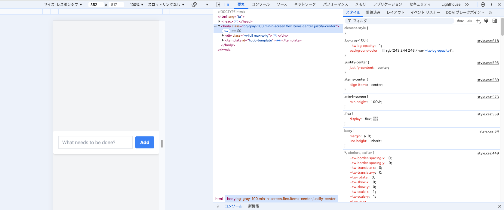

# 練習問題 15 章 15.4-10

## 問題 15.4-10.3 🖋️

ブラウザの開発者ツールを使うと CSS のデバッグを効率的に行うことができる。
[CSS のデバッグ](https://developer.mozilla.org/ja/docs/Learn/CSS/Building_blocks/Debugging_CSS) を参考にして以下を実施しなさい:

1. 15.4-10.1 および 15.4-10.2 の ToDo アプリに対してブラウザの開発者ツールから値の変更やプロパティの追加を試してみなさい
2. 開発者ツールで CSS に関して実行できる操作を検索エンジンで調べ、便利だと思ったものを 3 つ挙げなさい
3. [レイアウトの検査](https://developer.chrome.com/docs/devtools/css/grid?hl=ja)
   - 意図通りにパーツが配置されないときに便利だと思いました。
4. [スタイルの動的変更](https://developer.chrome.com/docs/devtools/css?hl=ja)
   - デザインの微調整に便利だと思いました
5. [hCSS の概要: CSS で改善できる点を特定する](https://developer.chrome.com/docs/devtools/css-overview?hl=ja)
   - コントラストが低く問題のあるフォントの検出が役に立つと思いました

## 3. 15.4-10.2 のアプリの `body` 要素に対し、元々 HTML および JS 内で利用していなかった Tailwind CSS のクラス (`bg-rose-600` など何でも良い) を開発者ツールから追加すると変更が反映されないが、これは何故か調べなさい

読み込んでいる _CSS_ (ex02の場合、 `style.css`)に定義がないため参照できないから。
`style.css`に定義されていないクラスを指定すると、スタイルペインの上から2つめの項目が表示されなくなる。

**出題範囲**: 15.4
