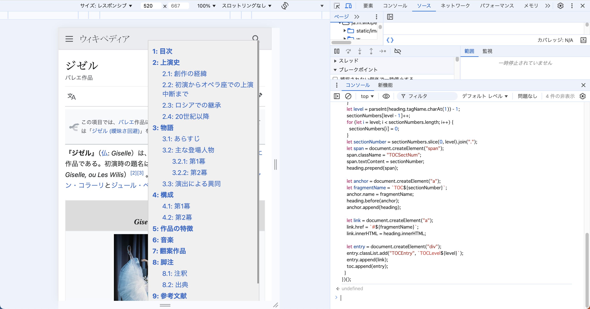
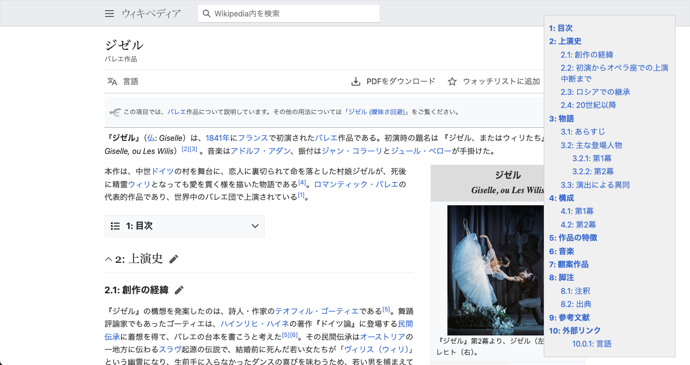

## 問1

### 結果



## 問２

2. TOC.js をブックマークレットにして簡単に実行できるようにしなさい (`javascript:{TOC.js のコード}` というブックマークを作成)

### ブックマークレット

```javascript
javascript:(()%3D%3E%7B%2F*%20NOTE%3A%20%E3%83%96%E3%83%83%E3%82%AF%E3%83%9E%E3%83%BC%E3%82%AF%E3%83%AC%E3%83%83%E3%83%88%E3%81%AB%E3%82%88%E3%81%A3%E3%81%A6%E5%AE%9F%E8%A1%8C%E3%81%99%E3%82%8B%E6%83%B3%E5%AE%9A%E3%81%AE%E3%81%9F%E3%82%81%20DOMContentLoaded%20%E3%81%AE%E3%82%A4%E3%83%99%E3%83%B3%E3%83%88%E3%81%A7%E5%AE%9F%E8%A1%8C%E3%81%97%E3%81%AA%E3%81%84%20*%2F%20let%20toc%3Ddocument.querySelector(%22%23TOC%22)%3Bif(!toc)%7Btoc%3Ddocument.createElement(%22div%22)%3Btoc.id%3D%22TOC%22%3Bdocument.body.prepend(toc)%3B%7D%2F*%20NOTE%3A%20%E3%82%B9%E3%82%BF%E3%82%A4%E3%83%AB%E3%82%92%E8%A8%AD%E5%AE%9A%20*%2F%20let%20style%3Ddocument.querySelector(%22%23TOC-style%22)%3Bif(!style)%7Bstyle%3Ddocument.createElement(%22style%22)%3Bstyle.id%3D%22TOC-style%22%3Bdocument.body.prepend(style)%3B%7Dstyle.textContent%3D%60%20%23TOC%7Bborder%3A%20solid%20black%201px%3Bmargin%3A%2010px%3Bpadding%3A%2010px%3B%2F*%20%E8%BF%BD%E5%8A%A0(%E5%8F%B3%E4%B8%8A%E3%81%AB%E5%9B%BA%E5%AE%9A%E8%A1%A8%E7%A4%BA)*%2F%20position%3A%20fixed%3Btop%3A%2020px%3Bright%3A%2020px%3Bwidth%3A%20250px%3Bpadding%3A%2010px%3Bbackground-color%3A%20%23f0f0f0%3Bborder%3A%201px%20solid%20%23ccc%3Boverflow-y%3A%20auto%3Bmax-height%3A%20calc(100vh%20-%2040px)%3Bz-index%3A%209999%3B%7D.TOCEntry%7Bmargin%3A%205px%200px%3B%7D.TOCEntry%20a%7Btext-decoration%3A%20none%3B%7D.TOCLevel1%7Bfont-weight%3A%20bold%3B%7D.TOCLevel2%7Bmargin-left%3A%20.25in%3B%7D.TOCLevel3%7Bmargin-left%3A%20.5in%3B%7D.TOCSectNum%3Aafter%7Bcontent%3A%20%22%3A%20%22%3B%7D%60%3B%2F*%20NOTE%3A%20%E4%BB%A5%E4%B8%8B%E3%81%AF%E6%9B%B8%E7%B1%8D%E3%81%AE%E3%82%B5%E3%83%B3%E3%83%97%E3%83%AB%E3%81%A8%E5%90%8C%E3%81%98%20*%2F%20let%20headings%3Ddocument.querySelectorAll(%22h2%2Ch3%2Ch4%2Ch5%2Ch6%22)%3Blet%20sectionNumbers%3D%5B0%2C0%2C0%2C0%2C0%5D%3Bfor(let%20heading%20of%20headings)%7Bif(heading.parentNode%3D%3D%3Dtoc)%7Bcontinue%3B%7Dlet%20level%3DparseInt(heading.tagName.charAt(1))-%201%3BsectionNumbers%5Blevel%20-%201%5D%2B%2B%3Bfor(let%20i%3Dlevel%3Bi%20%3C%20sectionNumbers.length%3Bi%2B%2B)%7BsectionNumbers%5Bi%5D%3D0%3B%7Dlet%20sectionNumber%3DsectionNumbers.slice(0%2Clevel).join(%22.%22)%3Blet%20span%3Ddocument.createElement(%22span%22)%3Bspan.className%3D%22TOCSectNum%22%3Bspan.textContent%3DsectionNumber%3Bheading.prepend(span)%3Blet%20anchor%3Ddocument.createElement(%22a%22)%3Blet%20fragmentName%3D%60TOC%24%7BsectionNumber%7D%60%3Banchor.name%3DfragmentName%3Bheading.before(anchor)%3Banchor.append(heading)%3Blet%20link%3Ddocument.createElement(%22a%22)%3Blink.href%3D%60%23%24%7BfragmentName%7D%60%3Blink.innerHTML%3Dheading.innerHTML%3Blet%20entry%3Ddocument.createElement(%22div%22)%3Bentry.classList.add(%22TOCEntry%22%2C%60TOCLevel%24%7Blevel%7D%60)%3Bentry.append(link)%3Btoc.append(entry)%3B%7D%7D)()%3Bvoid(0);
```

### 結果


