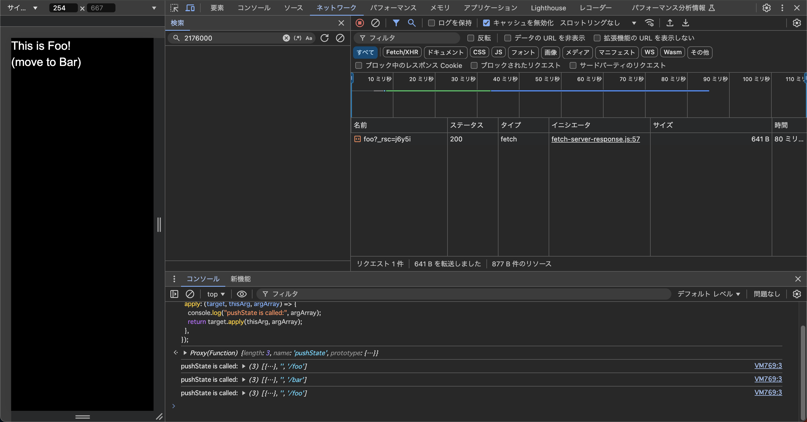

<dl>
  <dt>
    ブラウザの開発者ツールの「ネットワーク」タブを確認してみよう。リンクをクリックしたときに通信は発生しているだろうか？
  </dt>
  <dd>
    
最初はするが、リンクをクリックして常に通信が発生するわけではない

    <figure>
      
      <figcaption>図 リンク押下時のデベロッパーツールのスクリーンショット</figcaption>
    </figure>
  </dd>
  <dt>
    pushState はいつ実行されているだろうか？
  </dt>
  <dd>
    `pushState`は常に呼び出される。
  </dd>
  <dt>
    15.4-10.12 では pushState を使った実装でページのリロード時に正しく動作しなかったが、この問題ではどうだろうか？
  </dt>
  <dd>
    動作する。
  </dd>
</dl>
